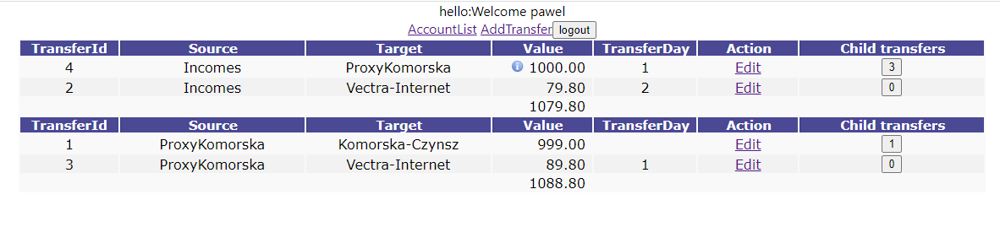

<!--Category:C#,SQL--> 
 

    <a href="http://productivitytools.tech/productivitytools-createsqlserverdatabase/"><a> 
    

    

# Transfers Web

Application stores information about transfers in the hierarchical structure.

<!---more--->

